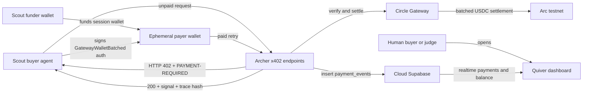

# Quiver

Two AI agents that earn and spend real money, fractions of a cent at a time, over x402 on Arc.

Quiver is a Lepton Agents Hackathon project built on the `circlefin/arc-nanopayments` starter. **Archer** is the seller agent: it produces strategy signals, protects them behind x402, and receives USDC through Circle Gateway. **Scout** is the buyer agent: it runs on a USDC budget, evaluates Archer's paid endpoints, and spends only when a signal is worth buying.

The current deployed v0 proves the core loop: a public Archer endpoint returns `402 Payment Required`, Scout signs and retries with a Circle Gateway batched authorization, Archer returns `200 OK`, and the settled payment is recorded in Supabase.

Live v0: [https://quiver-self.vercel.app](https://quiver-self.vercel.app)

## Why It Matters

Most x402 examples sell one discrete API response at a time. Quiver starts there, then builds toward the project headline: **pay-per-second streaming over x402**, composed from many small EIP-3009 authorizations that Circle Gateway batches for settlement on Arc.

The v0 focuses on the existence proof that matters first:

- A deployed, payable Archer endpoint.
- Real testnet USDC settlement through Circle Gateway.
- A buyer agent transacting over the public internet.
- A dashboard showing payments, payer addresses, endpoints, amounts, and seller Gateway balance.
- A simple verifiable reasoning trace attached to each Archer response.

## Project Flow



## Architecture

- **Frontend and API:** Next.js App Router.
- **Seller agent:** Archer endpoints under `app/api/archer`.
- **Buyer agent:** Scout script in `agent.mts`.
- **Payment protocol:** x402 (`402` response, `PAYMENT-REQUIRED`, signed retry, `PAYMENT-RESPONSE`).
- **Settlement:** Circle Gateway batched settlement on Arc testnet.
- **Persistence:** Cloud Supabase stores `payment_events` and withdrawals.
- **Dashboard:** live payments table, Gateway balance dialog, and withdrawal UI.
- **Grounding document:** `docs/PRD.md` is the product source of truth for future work.

Circle Gateway requires a long enough authorization window for batched settlement. Quiver currently uses `maxTimeoutSeconds = 604900` (7 days plus buffer) in `lib/x402.ts`, which avoids Gateway's `authorization_validity_too_short` rejection.

## Archer Endpoints

All Archer endpoints are x402-protected and settle sub-cent USDC payments on Arc testnet.

- `GET /api/archer/signal` costs `$0.001` and returns Archer's latest v0 strategy signal.
- `GET /api/archer/market-state` costs `$0.0001` and returns the current market-state snapshot.
- `POST /api/archer/compute` costs `$0.003` and runs a deeper v0 Archer analysis over submitted context.

Each response includes:

- `decision`: `buy`, `sell`, or `hold`.
- `confidence`: a number from `0` to `1`.
- `factors`: short human-readable reasons behind the signal.
- `reasoning.trace_hash`: a SHA-256 hash of the canonicalized reasoning trace.

The trace is intentionally simple for v0. A buyer can recompute the hash over the returned `reasoning.trace` object with sorted keys to confirm the trace was not altered.

## Scout Buyer Agent

Scout runs locally today:

```bash
BASE_URL=https://quiver-self.vercel.app npm run agent -- --limit 0.001
```

The persistent `BUYER_PRIVATE_KEY` is a funder wallet. On each run, Scout creates a fresh ephemeral payer wallet, transfers gas and USDC to it, deposits into Gateway, and pays Archer from that session wallet. This makes payer addresses differ between runs while the budget is still controlled at the funder level.

## Getting Started

Install dependencies:

```bash
npm install
```

Create your env file:

```bash
cp .env.example .env.local
```

Generate test wallets:

```bash
npm run generate-wallets
```

Fund the buyer/funder wallet with Arc testnet USDC from the [Circle faucet](https://faucet.circle.com/).

Set up cloud Supabase:

```bash
npx supabase link --project-ref <your-project-ref>
npx supabase db push
```

Run the seller app:

```bash
npm run dev
```

Run Scout locally:

```bash
npm run agent -- --limit 0.001
```

## Environment Variables

Required for the deployed seller app:

```bash
NEXT_PUBLIC_SUPABASE_URL=your-project-url
NEXT_PUBLIC_SUPABASE_PUBLISHABLE_KEY=your-publishable-or-anon-key
SUPABASE_SERVICE_ROLE_KEY=your-service-role-key
ADMIN_EMAIL=your-dashboard-email
ADMIN_PASSWORD=your-dashboard-password
SELLER_ADDRESS=0xYourSellerWalletAddress
SELLER_PRIVATE_KEY=0xYourSellerPrivateKey
```

Required only for running Scout:

```bash
BUYER_ADDRESS=0xYourBuyerFunderAddress
BUYER_PRIVATE_KEY=0xYourBuyerFunderPrivateKey
```

Optional:

```bash
OPENAI_API_KEY=your-openai-api-key
```

## Dashboard

The dashboard is available at `/dashboard`.

Dashboard access is controlled by `ADMIN_EMAIL` and `ADMIN_PASSWORD`. Set strong, private values in Vercel before deploying and do not publish them in the repo.

The dashboard shows:

- Incoming Archer payments.
- Payer addresses, endpoints, amounts, and Gateway transaction IDs.
- Seller Gateway balance and wallet balance.
- Withdrawal tooling inherited from the starter.

## Deployment

Quiver is deployed on Vercel with cloud Supabase. Set the seller env vars in Vercel before deploying so the first build has Supabase and seller wallet configuration.

For v0, do not put buyer keys in Vercel. Scout runs locally against the deployed `BASE_URL`.

## Security And Scope

This is a testnet hackathon project:

- Uses Arc testnet USDC only.
- Uses throwaway generated wallets.
- Keeps `.env` and `.env.local` out of git.
- Keeps dashboard credentials in private environment variables.
- Stores the seller private key in Vercel env vars only for testnet demo purposes.
- Does not provide investment advice and is not a production trading system.

## Roadmap

- Dynamic Archer pricing based on compute cost and confidence.
- Scout cost-benefit logic that can decline low-confidence signals.
- Human-friendly pay-once path for traction.
- Pay-per-second x402 streaming with one ephemeral wallet per stream session and many per-tick Gateway authorizations.
