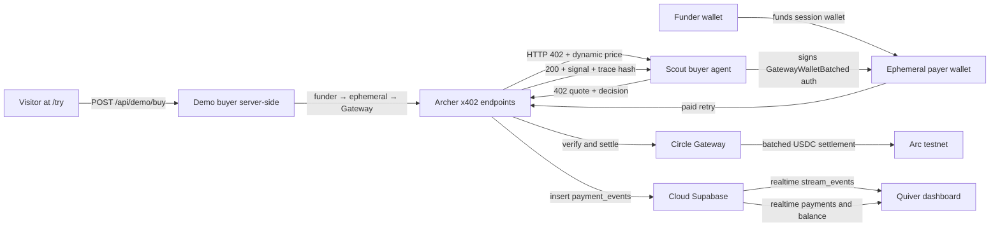

<p align="center">
  
</p>

# Quiver

Quiver is a per-second x402 settlement rail on Arc. Archer and Scout are the agent demo of it; an Owncast sidecar is the creator-stack deployment of the same rail.

Quiver is a Lepton Agents Hackathon project built on the `circlefin/arc-nanopayments` starter. It bills for exactly the seconds consumed and stops the instant signing stops, composing a streaming rail from per-tick EIP-3009 authorizations that Circle Gateway batches on Arc testnet. **Archer** is the seller agent: it produces strategy signals, prices each request dynamically, protects them behind x402, and receives USDC through Circle Gateway. **Scout** is the buyer agent: it runs on a funder-level USDC budget, evaluates Archer's quoted price and confidence per call, and buys or declines with a logged reason.

**Official domain:** [https://getquiver.xyz](https://getquiver.xyz) · **Public demo:** [https://getquiver.xyz/try](https://getquiver.xyz/try)

## Why It Matters

Most x402 examples sell one discrete API response at a fixed price. Quiver makes the primitive the headline: **pay-per-second streaming over x402** — composed from many small EIP-3009 authorizations that Circle Gateway batches for settlement on Arc. Archer and Scout prove the rail with autonomous pricing and buying decisions; the same per-second core now has a verified local Owncast sidecar where chat presence drives creator-stream ticks.

What's shipped today:

- Deployed Archer x402 endpoints with **dynamic pricing** (compute- and confidence-pegged) and logged reason strings.
- **Scout** with per-call buy/decline logic against quoted price, confidence, and remaining funder budget.
- **`/try`** — an honestly-labeled, demo-funded human path (no wallet required) that triggers a real settlement.
- **Pay-per-second streaming** — per-tick x402 loop (`GET /api/archer/stream`), `stream_events` table, Scout CLI (`npm run stream`), dashboard live meter with tap-to-stop.
- Dashboard metrics that **separate demo buys, Scout payments, and stream ticks** (`payment_events.raw.source`).
- Verifiable reasoning trace (SHA-256 hash) on every Archer response.
- **Owncast sidecar** — local Owncast `0.2.5` replay verified the presence model: `CHAT` starts the stream, `USER_PARTED` closes it, and `GET /api/integrations/clients` heartbeat is the fallback. Proof session `25418b23-4f15-4146-aad8-3038320a011e` wrote a verified `stream_events` tick with Owncast metadata; heartbeat-only session `bc3fa644-031f-4bfa-89d1-7c4849aad1fb` stopped without `USER_PARTED` delivered to the sidecar.

## External Agent Validation

Obol independently tested Quiver as an external x402 buyer and bought `GET /api/archer/signal`, paying **0.00063 USDC** for a confidence-priced signal. The paid response returned a clean `sell` signal plus Quiver's `trace_hash`, validating the paid signal and verifiable reasoning path outside Quiver's own Scout and demo flows.

Obol also scored Quiver on-chain with its agent. Proof transaction: [0x883706f4708c046cd5043c560ad55519ad75a09d63aa9ded9cf782007cd3f6cc](https://testnet.arcscan.app/tx/0x883706f4708c046cd5043c560ad55519ad75a09d63aa9ded9cf782007cd3f6cc).

## Project Flow



## Architecture

- **Frontend and API:** Next.js App Router.
- **Seller agent:** Archer endpoints under `app/api/archer` (`lib/archer/strategy.ts`, `lib/archer/pricing.ts`).
- **Buyer agent:** Scout script in `agent.mts` (`lib/scout/decision.ts`, `lib/scout/quote.ts`); streaming in `lib/scout/stream.ts` + `stream.mts`.
- **Demo path:** `app/try/page.tsx` + `POST /api/demo/buy` (`lib/demo/gateway-buyer.ts`); dashboard stream via `POST /api/demo/stream/*`.
- **Payment protocol:** x402 (`402` → `PAYMENT-REQUIRED` → signed retry → `200` + `PAYMENT-RESPONSE`).
- **Settlement:** Circle Gateway batched settlement on Arc testnet.
- **Persistence:** Cloud Supabase `payment_events` and `stream_events` (source tagged in `raw.source`: `demo` | `scout` | `stream`).
- **Dashboard:** payments + **live stream meter** (authorized/verified volume, tap-to-stop), source badges, Gateway balance, withdrawals.
- **Grounding document:** `docs/PRD.md` is the product source of truth; `docs/ROADMAP.md` tracks what's shipped and what's next.

Circle Gateway requires a long enough authorization window for batched settlement. Quiver uses `maxTimeoutSeconds = 604900` (7 days plus buffer) in `lib/x402.ts`.

## Archer Endpoints

All Archer endpoints are x402-protected and settle sub-cent USDC on Arc testnet. **Prices are dynamic per request** — base tiers below are floors/anchors, not fixed quotes.

| Endpoint | Base tier | Pricing axes |
|----------|-----------|--------------|
| `GET /api/archer/signal` | ~$0.001 | Confidence multiplier on base |
| `GET /api/archer/market-state` | ~$0.0001 | Cheap lookup (minimal variation) |
| `GET /api/archer/stream` | ~$0.0001/sec | Per-tick live decision feed slice (streaming) |
| `POST /api/archer/compute` | ~$0.003 | +10% per KB of submitted context |

Each 402 includes `extensions.quiver` with `price_usdc`, `price_reason`, and `confidence`. Each 200 response includes:

- `decision`: `buy`, `sell`, or `hold`
- `confidence`: 0–1
- `factors`: human-readable signal inputs
- `price_reason`: Archer's logged pricing decision
- `reasoning.trace_hash`: SHA-256 over the canonicalized trace

## Scout Buyer Agent

Scout runs locally against the deployed seller:

```bash
BASE_URL=https://getquiver.xyz npm run agent -- --limit 0.01
```

**Decision rule (one sentence):** Scout buys when confidence ≥ 0.45 and quoted price ≤ confidence × remaining funder budget; otherwise it declines and logs why.

The persistent `BUYER_PRIVATE_KEY` is a **funder wallet**. Each run creates a fresh ephemeral payer wallet, funds it, deposits into Gateway, and pays Archer from that session. Budget is tracked at the funder level via `--limit`.

## Pay-per-second streaming

Streaming is **many discrete per-tick EIP-3009 authorizations** (not a native rate primitive). One ephemeral wallet per session, funded once; each tick calls `GatewayClient.pay()` with long-validity auth (`maxTimeoutSeconds = 604900`).

**Scout CLI** (local, funder-funded):

```bash
BASE_URL=https://getquiver.xyz npm run stream -- --ticks 10
# Options: --limit 0.01 (USDC cap)  --interval 1000 (ms between tick completions)
```

**Dashboard** (operator sign-in at `/dashboard`): **Live stream** panel — Start/Stop, realtime meter on `stream_events`, exact-cost invariant on stop (`ticks × $0.0001 = total`).

**Spike test** (go/no-go gate — overlapping auths from one wallet at 1 Hz):

```bash
npm run spike:overlapping-auth
```

Apply Supabase migrations before streaming (`stream_events` + realtime publication):

```bash
npx supabase db push
# Or paste supabase/migrations/20260318100000_create_stream_events.sql
# then 20260318100001_enable_stream_realtime.sql in the SQL editor.
```

Verify realtime delivery:

```bash
node --experimental-transform-types --no-warnings --env-file=.env.local scripts/verify-stream-realtime.mts
```

## Owncast sidecar

The Owncast sidecar runs as a local Node process next to an Owncast server. It receives `POST /webhooks/incoming`, starts Quiver's existing per-second stream on Owncast `CHAT` or `USER_JOINED`, stops on `USER_PARTED`, and uses `GET /api/integrations/clients` as the heartbeat fallback if a close event is missed.

Run the sidecar against local Owncast:

```bash
OWNCAST_URL=http://localhost:8080 \
OWNCAST_ACCESS_TOKEN=<token> \
BASE_URL=http://localhost:3000 \
npm run owncast:sidecar
```

The verified local model is intentionally precise: do not describe it as a pure `USER_JOINED` / `USER_PARTED` window for Owncast `0.2.5`; `USER_JOINED` was not observed in the replay. `CHAT` is the verified start signal, `USER_PARTED` is the verified clean-close signal, heartbeat is the verified fallback, and `stream_events` remains the billing source of truth. See `docs/OWNCAST_STAGE_1.md` for the verdict table.

## Try Quiver (human demo path)

Public page: **`/try`** — no wallet, one click.

- Calls `POST /api/demo/buy` (default: `/api/archer/signal`).
- Server runs the same funder → ephemeral → Gateway → Archer flow as Scout.
- Settlements are **real** but tagged `demo` in `payment_events.raw.source` — not counted as distinct paying visitors.
- Rate-limited per IP (`DEMO_RATE_LIMIT_SECONDS`, default 30s) to protect the funder wallet. This is an in-memory, per-instance testnet guardrail; it is honest demo protection, not production abuse prevention.

Share **`https://getquiver.xyz/try`** for traction outreach.

## Getting Started

```bash
npm install
cp .env.example .env.local
npm run generate-wallets
```

Fund the buyer/funder wallet from the [Circle faucet](https://faucet.circle.com/).

```bash
npx supabase link --project-ref <your-project-ref>
npx supabase db push
npm run dev
npm run agent -- --limit 0.01
```

Open [http://localhost:3000/try](http://localhost:3000/try) for the local demo path.

## Environment Variables

**Vercel (seller + demo):**

```bash
NEXT_PUBLIC_SUPABASE_URL=your-project-url
NEXT_PUBLIC_SUPABASE_PUBLISHABLE_KEY=your-publishable-or-anon-key
SUPABASE_SERVICE_ROLE_KEY=your-service-role-key
ADMIN_EMAIL=your-dashboard-email
ADMIN_PASSWORD=your-dashboard-password
SELLER_ADDRESS=0xYourSellerWalletAddress
SELLER_PRIVATE_KEY=0xYourSellerPrivateKey
BASE_URL=https://getquiver.xyz
BUYER_PRIVATE_KEY=0xYourBuyerFunderPrivateKey
DEMO_RATE_LIMIT_SECONDS=30
DEMO_DEPOSIT_AMOUNT=0.01
```

`BUYER_PRIVATE_KEY` is required in Vercel for the `/try` demo path (server-side funder). Scout still runs locally with the same key in `.env.local`.

**Local only (Scout + demo dev):**

```bash
BUYER_ADDRESS=0xYourBuyerFunderAddress
BUYER_PRIVATE_KEY=0xYourBuyerFunderPrivateKey
BASE_URL=http://localhost:3000
```

Optional: `OPENAI_API_KEY`

## Dashboard

Sign in at `/` → `/dashboard` (credentials from `ADMIN_EMAIL` / `ADMIN_PASSWORD`).

The dashboard shows:

- **Demo buys** vs **Scout payments** vs **stream ticks** (separate counts and volume)
- Distinct Scout payer addresses (excludes demo)
- Per-row **source** badge (`demo` | `scout` | `stream`)
- **Live stream meter** — authorized total, rate, duration, tap-to-stop, exact-cost invariant
- Gateway balance, withdrawals, realtime payment feed

## Judge Walkthrough

1. Open [https://getquiver.xyz/try](https://getquiver.xyz/try) and click **Buy Archer signal (demo)**.
2. Confirm the result shows the settled USDC amount, Archer's price reason, the trace hash, and an Arcscan transaction link when a transaction hash is available.
3. Sign in to `/dashboard` with the provided operator credentials and confirm the payment row is tagged `demo`.
4. Start the **Pay-per-second Archer feed**, let a few ticks land, then stop it. The invariant should read `ticks × $0.0001 = total` using verified `stream_events`.
5. Run Scout locally against production to show agentic buy/decline decisions:

```bash
BASE_URL=https://getquiver.xyz npm run agent -- --limit 0.01
```

6. Before recording or submitting, run `npm run verify:demo-readiness` locally.
7. Use the dashboard metrics for submission numbers: report demo buys, Scout payments, stream ticks, and distinct Scout payers separately.

## Deployment

Quiver deploys on Vercel with cloud Supabase. The official public domain is `getquiver.xyz`; the Vercel project remains the hosting target.

1. Set all Vercel env vars above (use `BASE_URL=https://getquiver.xyz`, not a preview URL).
2. Push to `main` — Vercel redeploys automatically.
3. Verify live:
   - [https://getquiver.xyz/try](https://getquiver.xyz/try) loads and settles a demo buy
   - Rapid repeat clicks return `429`
   - Scout run tags payments `scout` with dynamic prices
   - Dashboard splits demo / Scout / stream metrics
   - **Stream meter** ticks up on its own when Start stream is pressed (realtime on `stream_events`)
   - `npm run verify:demo-readiness` passes lint and confirms stream tables / recent tick uniqueness

Keep the funder wallet topped up (~$1 minimum; refaucet from Circle if demo volume is high).

## Traction (report honestly)

| Metric | Source |
|--------|--------|
| Demo buys | `payment_events` where `raw.source = 'demo'` |
| Scout payments | `payment_events` where `raw.source = 'scout'` |
| Stream ticks | `payment_events` or `stream_events` where `raw.source = 'stream'` (authorized volume) |
| Distinct paying clients | Unique Scout payer addresses only (exclude demo) |
| Volume / avg size | Report demo and Scout separately or combined with labels |

## Security And Scope

Testnet hackathon project only:

- Arc testnet USDC, throwaway wallets
- `.env` / `.env.local` never committed
- Dashboard credentials private in Vercel
- Seller and buyer keys in Vercel for testnet demo purposes only
- Not investment advice; not a production trading system

## Roadmap

- [x] Dynamic Archer pricing (compute + confidence, logged reasons)
- [x] Scout per-call buy/decline logic
- [x] Human demo path (`/try`, honestly tagged)
- [x] Pay-per-second x402 streaming (loop + dashboard meter)
- [x] Partial stream adversarial hardening (timeouts, fail-closed UI, verified-count reconciliation)
- [ ] Stream hardening stretch: out-of-balance and abandoned-session cleanup
- [ ] Visitor pays with own wallet (stretch, post-streaming if time)
