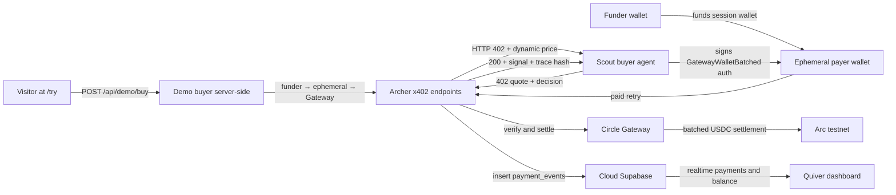

# Quiver

Two AI agents that earn and spend real money, fractions of a cent at a time, over x402 on Arc.

Quiver is a Lepton Agents Hackathon project built on the `circlefin/arc-nanopayments` starter. **Archer** is the seller agent: it produces strategy signals, prices each request dynamically, protects them behind x402, and receives USDC through Circle Gateway. **Scout** is the buyer agent: it runs on a funder-level USDC budget, evaluates Archer's quoted price and confidence per call, and buys or declines with a logged reason.

**Live deploy:** [https://quiver-self.vercel.app](https://quiver-self.vercel.app) · **Public demo:** [https://quiver-self.vercel.app/try](https://quiver-self.vercel.app/try)

## Why It Matters

Most x402 examples sell one discrete API response at a fixed price. Quiver adds **agentic pricing and buying decisions** on top of the starter loop, then builds toward the project headline: **pay-per-second streaming over x402**, composed from many small EIP-3009 authorizations that Circle Gateway batches for settlement on Arc.

What's shipped today:

- Deployed Archer x402 endpoints with **dynamic pricing** (compute- and confidence-pegged) and logged reason strings.
- **Scout** with per-call buy/decline logic against quoted price, confidence, and remaining funder budget.
- **`/try`** — an honestly-labeled, demo-funded human path (no wallet required) that triggers a real settlement.
- Dashboard metrics that **separate demo buys from Scout payments** (`payment_events.raw.source`).
- Verifiable reasoning trace (SHA-256 hash) on every Archer response.

## Project Flow



## Architecture

- **Frontend and API:** Next.js App Router.
- **Seller agent:** Archer endpoints under `app/api/archer` (`lib/archer/strategy.ts`, `lib/archer/pricing.ts`).
- **Buyer agent:** Scout script in `agent.mts` (`lib/scout/decision.ts`, `lib/scout/quote.ts`).
- **Demo path:** `app/try/page.tsx` + `POST /api/demo/buy` (`lib/demo/gateway-buyer.ts`).
- **Payment protocol:** x402 (`402` → `PAYMENT-REQUIRED` → signed retry → `200` + `PAYMENT-RESPONSE`).
- **Settlement:** Circle Gateway batched settlement on Arc testnet.
- **Persistence:** Cloud Supabase `payment_events` (source tagged in `raw.source`: `demo` | `scout`).
- **Dashboard:** payments table with source badges, demo vs Scout metrics, Gateway balance, withdrawals.
- **Grounding document:** `docs/PRD.md` is the product source of truth.

Circle Gateway requires a long enough authorization window for batched settlement. Quiver uses `maxTimeoutSeconds = 604900` (7 days plus buffer) in `lib/x402.ts`.

## Archer Endpoints

All Archer endpoints are x402-protected and settle sub-cent USDC on Arc testnet. **Prices are dynamic per request** — base tiers below are floors/anchors, not fixed quotes.

| Endpoint | Base tier | Pricing axes |
|----------|-----------|--------------|
| `GET /api/archer/signal` | ~$0.001 | Confidence multiplier on base |
| `GET /api/archer/market-state` | ~$0.0001 | Cheap lookup (minimal variation) |
| `POST /api/archer/compute` | ~$0.003 | +10% per KB of submitted context |

Each 402 includes `extensions.quiver` with `price_usdc`, `price_reason`, and `confidence`. Each 200 response includes:

- `decision`: `buy`, `sell`, or `hold`
- `confidence`: 0–1
- `factors`: human-readable signal inputs
- `price_reason`: Archer's logged pricing decision
- `reasoning.trace_hash`: SHA-256 over the canonicalized trace

## Scout Buyer Agent

Scout runs locally against the deployed seller:

```bash
BASE_URL=https://quiver-self.vercel.app npm run agent -- --limit 0.01
```

**Decision rule (one sentence):** Scout buys when confidence ≥ 0.45 and quoted price ≤ confidence × remaining funder budget; otherwise it declines and logs why.

The persistent `BUYER_PRIVATE_KEY` is a **funder wallet**. Each run creates a fresh ephemeral payer wallet, funds it, deposits into Gateway, and pays Archer from that session. Budget is tracked at the funder level via `--limit`.

## Try Quiver (human demo path)

Public page: **`/try`** — no wallet, one click.

- Calls `POST /api/demo/buy` (default: `/api/archer/signal`).
- Server runs the same funder → ephemeral → Gateway → Archer flow as Scout.
- Settlements are **real** but tagged `demo` in `payment_events.raw.source` — not counted as distinct paying visitors.
- Rate-limited per IP (`DEMO_RATE_LIMIT_SECONDS`, default 30s) to protect the funder wallet.

Share **`https://quiver-self.vercel.app/try`** for traction outreach.

## Getting Started

```bash
npm install
cp .env.example .env.local
npm run generate-wallets
```

Fund the buyer/funder wallet from the [Circle faucet](https://faucet.circle.com/).

```bash
npx supabase link --project-ref <your-project-ref>
npx supabase db push
npm run dev
npm run agent -- --limit 0.01
```

Open [http://localhost:3000/try](http://localhost:3000/try) for the local demo path.

## Environment Variables

**Vercel (seller + demo):**

```bash
NEXT_PUBLIC_SUPABASE_URL=your-project-url
NEXT_PUBLIC_SUPABASE_PUBLISHABLE_KEY=your-publishable-or-anon-key
SUPABASE_SERVICE_ROLE_KEY=your-service-role-key
ADMIN_EMAIL=your-dashboard-email
ADMIN_PASSWORD=your-dashboard-password
SELLER_ADDRESS=0xYourSellerWalletAddress
SELLER_PRIVATE_KEY=0xYourSellerPrivateKey
BASE_URL=https://quiver-self.vercel.app
BUYER_PRIVATE_KEY=0xYourBuyerFunderPrivateKey
DEMO_RATE_LIMIT_SECONDS=30
DEMO_DEPOSIT_AMOUNT=0.01
```

`BUYER_PRIVATE_KEY` is required in Vercel for the `/try` demo path (server-side funder). Scout still runs locally with the same key in `.env.local`.

**Local only (Scout + demo dev):**

```bash
BUYER_ADDRESS=0xYourBuyerFunderAddress
BUYER_PRIVATE_KEY=0xYourBuyerFunderPrivateKey
BASE_URL=http://localhost:3000
```

Optional: `OPENAI_API_KEY`

## Dashboard

Sign in at `/` → `/dashboard` (credentials from `ADMIN_EMAIL` / `ADMIN_PASSWORD`).

The dashboard shows:

- **Demo buys** vs **Scout payments** (separate counts and volume)
- Distinct Scout payer addresses (excludes demo)
- Per-row **source** badge (`demo` | `scout`)
- Gateway balance, withdrawals, realtime payment feed

## Deployment

Quiver deploys on Vercel with cloud Supabase.

1. Set all Vercel env vars above (use your **stable** production domain for `BASE_URL`, not a preview URL).
2. Push to `main` — Vercel redeploys automatically.
3. Verify live:
   - [https://quiver-self.vercel.app/try](https://quiver-self.vercel.app/try) loads and settles a demo buy
   - Rapid repeat clicks return `429`
   - Scout run tags payments `scout` with dynamic prices
   - Dashboard splits demo vs Scout metrics

Keep the funder wallet topped up (~$1 minimum; refaucet from Circle if demo volume is high).

## Traction (report honestly)

| Metric | Source |
|--------|--------|
| Demo buys | `payment_events` where `raw.source = 'demo'` |
| Scout payments | `payment_events` where `raw.source = 'scout'` |
| Distinct paying clients | Unique Scout payer addresses only (exclude demo) |
| Volume / avg size | Report demo and Scout separately or combined with labels |

## Security And Scope

Testnet hackathon project only:

- Arc testnet USDC, throwaway wallets
- `.env` / `.env.local` never committed
- Dashboard credentials private in Vercel
- Seller and buyer keys in Vercel for testnet demo purposes only
- Not investment advice; not a production trading system

## Roadmap

- [x] Dynamic Archer pricing (compute + confidence, logged reasons)
- [x] Scout per-call buy/decline logic
- [x] Human demo path (`/try`, honestly tagged)
- [ ] Pay-per-second x402 streaming (headline — days 7–10)
- [ ] Visitor pays with own wallet (stretch, post-streaming if time)
